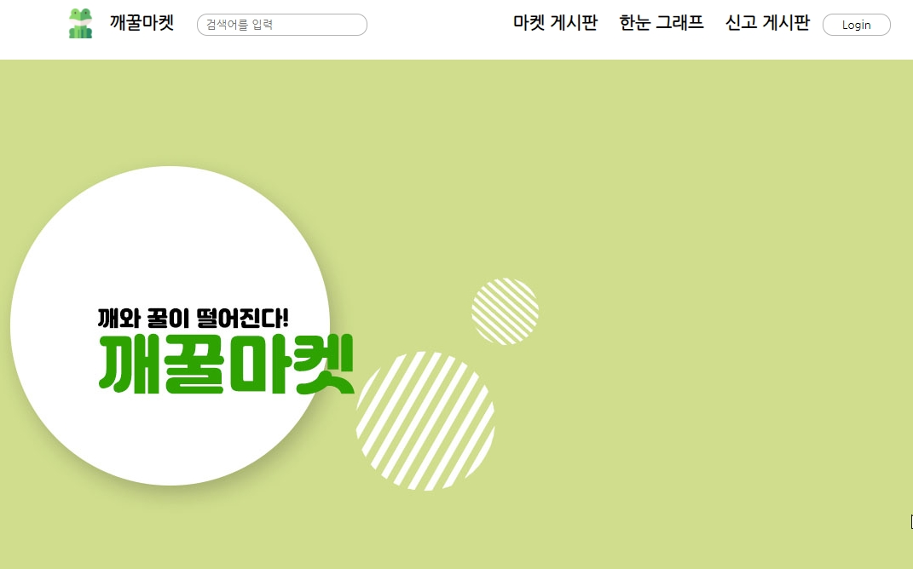
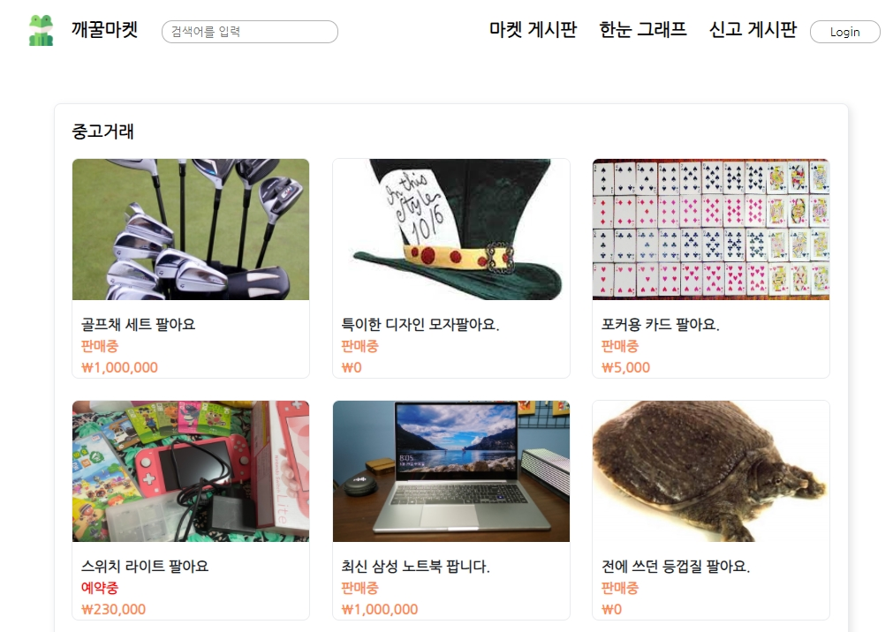
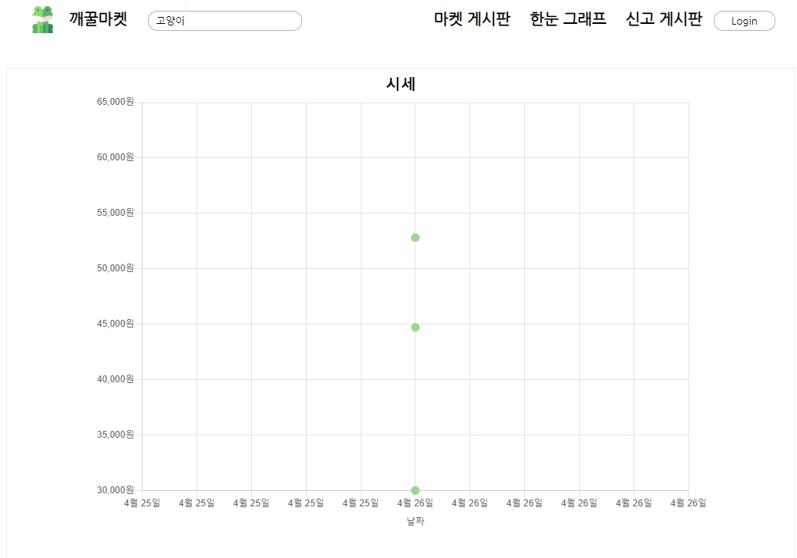

# FrogMarket - 깨꿀마켓

KH정보교육원 세미 프로젝트

## 프로젝트 개요
중고거래 앱, 사이트에 대한 이용률이 점점 증가하고 있다. 중고거래의 경우 개인 판매자가 가격을 정하므로 
제품의 시세를 알기가 힘들다는 문제점이 있다. 그러므로 중고거래 사이트에 분산형 그래프를 추가하여 
시세를 한눈에 파악할 수 있도록 한다.
주 목표는 기본적인 CRUD기능 구현과 그래프를 통한 시세확인 기능 구현이다.

## 개발 기간
2021.4.14 ~ 2021.4.28

### 추가 수정
2021.4.29 ~ 
* JSTL, EL 사용
* 개인적인 디자인 및 코드 수정

## 개발 환경
### 개발 언어
Java, jQuery, Oracle, Html, CSS, JavaScript

### 개발툴
Eclipse, SQL Developer, VS Code

## 주요 기능
 1. 메인
    * 상품 검색
    * 그래프로 상품 시세 확인, 검색
    * 로그인
 2. 회원
    * 상품게시글 등록, 수정, 삭제
    * 댓글 등록, 수정
    * 장바구니 등록, 삭제
    * 신고게시글 등록, 수정, 삭제
    * 등록한 게시글, 달린 댓글 확인
    * 개인정보 수정, 탈퇴, 로그아웃
    * 타 회원 정보 확인, 좋아요 점수 부여
 4. 관리자
    * 일반 회원의 상품게시글, 신고게시글 등록, 수정, 삭제
    * 일반 회원의 댓글 등록, 수정
    * 회원 권한 변경
    

## 사이트 이미지
메인

게시판

그래프

